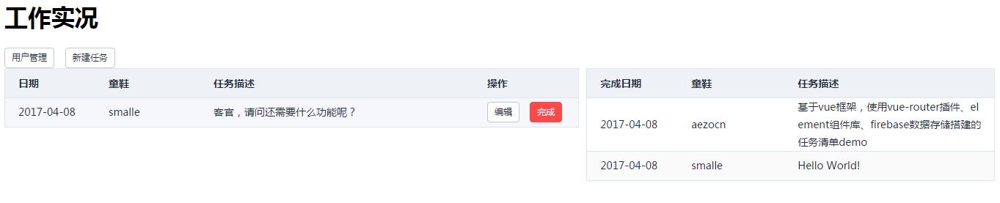

# vue.js

## 介绍

- [官方Doc (v2.0)](http://cn.vuejs.org/v2/guide/)
- 工具介绍
    - `vue-cli` vue脚手架：可通过npm安装，主要用于快速构建项目基本框架(v2.8.1 -> B01/B02/D01/D02)
    - `vue-devtools` vue调试工具，可在chrome商店下载安装此浏览器插件

## 笔记

### 语法

- 表单控件修饰符：`.lazy`、`.number`、`.trim`
- 组件
    - [属性data必须是函数](http://cn.vuejs.org/v2/guide/components.html#data-必须是函数)
        - 函数中 `return obj`(obj = {count: 0}) 和 `return {count: 0}` 不同。前者组件的实例共享一个对象，后者组件实例使用不同的对象
    - [属性Prop的字面量语法和动态语法](http://cn.vuejs.org/v2/guide/components.html#字面量语法-vs-动态语法)
        - `<comp some-prop="1"></comp>`传递给子组件的是字符串、`<comp v-bind:some-prop="1"></comp>`传递的是number类型
    - [属性Prop为单向数据流](http://cn.vuejs.org/v2/guide/components.html#单向数据流)
        - prop 是单向绑定的：当父组件的属性变化时，将传导给子组件，但是不会反过来
		
### vue打包app

> 使用vue-cli(v2.8.2)构建的项目，修改`config/index.js`(webpack.config.js)中`build.assetsPublicPath='./'`.(vue-cli v2.8.1未构建成功)

- 使用Hbuilder(方便)
	- cmd到开发路径下执行npm run build命令，生成dist文件夹
	- 新建App项目, 并将dist目录下的文件复制到app根目录
	- 项目名称右键-发行-发行为原生安装包。等待远程打包下载即可
- 使用cordova打包(需要安装android SDK)
	- 文档地址[http://cordova.apache.org/docs/en/latest/guide/cli/index.html](http://cordova.apache.org/docs/en/latest/guide/cli/index.html)
	- 其中运行`cordova requirements`会报android target未安装(本身是安装了需要生成应用对应API版本的sdk, 所需模板版本api版本查看：`platforms/android/project.properties`，如：target=android-25)
	
## 示例

- [A01-helloworld](https://oldinaction.github.io/smweb/vuejs/A01-helloworld/demo1.html)
    - 无需安装任何依赖，只需要将vue.js引入到html文件中即可
- B01-vuecli-webpack 使用vue-cli工具，初始化一个基于webpack模板的项目

    ```shell
    # 全局安装 vue-cli (vue脚手架：可初始化一个基本vue项目)
    $ npm install --global vue-cli
	# 创建项目(vue-cli v2.8.2)
    $ vue init webpack hello
    # 在当前目录创建一个基于 webpack 模板的项目(vue-cli v2.8.1)
    # $ vue init webpack-simple
    # 安装依赖，走你 (根据初始化的package.json安装)
    $ npm install
    # 启动服务器
    $ npm run dev
    ```

## Demo (点击链接查看效果)

- [D01-github-commit](https://oldinaction.github.io/smweb/vuejs/D01-github-commit/)
    - 基于github提供的api，展示项目提交详情 (生命周期钩子、计算属性、观测、过滤器、ajax)
- D02-work-element [github](https://github.com/oldinaction/smweb/tree/master/vuejs/D02-work-element)

    

    1. 概要：基于vue框架，使用vue-router插件、element组件库、firebase数据存储搭建的任务清单demo
    2. 运行步骤
        - 使用[element-starter通用模板(webpack)](https://github.com/ElementUI/element-starter)
        - `npm install` 安装依赖
        - `npm i vuex -S`、`npm i vue-router -S` 安装vue的vue-router(路由)和mixin
        - `npm i firebase -S` 安装firebase(Google提供的服务，[介绍传送门](http://blog.aezo.cn/service/2017/03/19/firebase/))
        - `moment` 安装这些依赖
        - `npm run dev` 启动服务
    3. 注意事项：
        - firebase数据库需要设置成可匿名登录
        - firebase数据库规则配置成公开访问

            ```json
            {
              "rules": {
                ".read": true,
                ".write": true
              }
            }
            ```
    4. 本示例思考：
        - 弹框页面和主页面分离
        - 新建一条数据后，vm.$data中关于此form的字段如何还原成初始值
